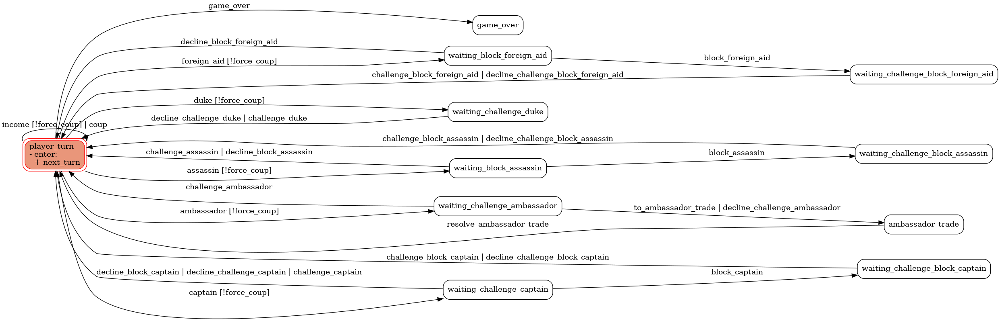

# Coup

A simulator of the Coup board game. 

## Install
This package uses [poetry](https://python-poetry.org/). 
- Run `poetry install` to install the dependencies. 
- Run `poetry shell` to start the `venv`, then `python3 coup.py`
- Run `pytest` in the `tests/` directory to run the pytest tests. 


## State Machine
The game is built around a state machine. See the [tests](tests/) directory for more information on using it. Eventually a runner should be written for it. 

Minimal example:

```python
from coup import *

players = [Player('test0'), Player('test1')] # Each player starts with 2 coins and 2 influence
c = Coup(players)
c.state # Returns the current state of the game, will return `player_turn`
c.trigger('income') # or c.income(), test0 uses income, ends turn with 3 coins
c.state # player_turn, but the player is test1
c.trigger('duke') # prepares to take three coins for test1
c.state # waiting_challenge_duke
c.trigger('decline_challenge_duke') # nobody wants to challenge duke, test1 has 5 coins and ends the turn.
print(c) # prints game state
```

The main way to use the `Coup` class is to use `c.trigger('action')`. This triggers a transition between states. 




## Todo
- [ ] Write a wrapper for the state machine
- [ ] Finish ambassador flow
- [ ] Rewrite to use geneic method for conflict resolution
- [ ] Write better test cases for all characters
- [ ] Fix game over states
